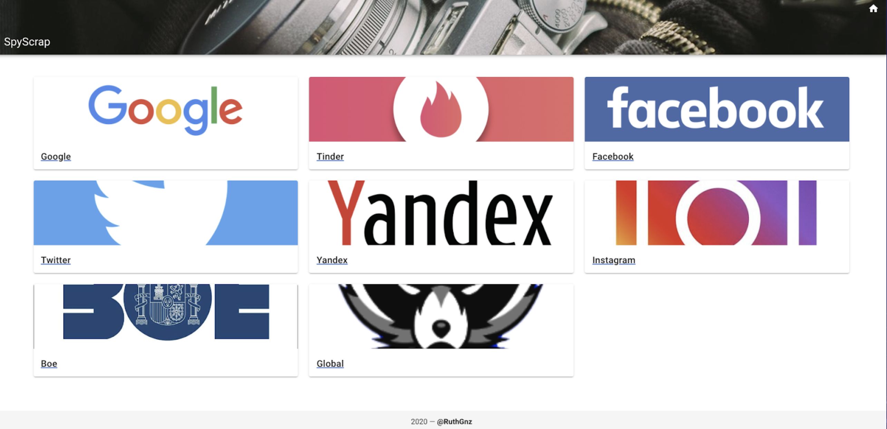

# CLI

CLI Module for web scraping:

* Tinder
* Instagram
* Yandex
* Google
* Facebook
* BOE


## Prerequisites

Docker and docker-compose


### Installation
```bash
docker build -t spyscrap .
docker run -ti -v /PATH/TO/SpyScrap/src/data:/spyscrap/data spyscrap  [options]
```
You must put the image you want to be used for facial recognition under the shared volume in docker as in the next example:
```
docker run -ti -v /Users/ruthgnz/Documents/osint/SpyScrap/src/data:/spyscrap/data sp  -t twitter -n "ruth gonzalez novillo" -i ./data/descarga.jpeg
```

## Usage

```bash
docker run -ti -v /PATH/TO/SpyScrap/src/data:/spyscrap/data spyscrap  [options]
```

Get Tinder users and store data in sqlite3 database. Tinder Token must be capturen when logging into Tinder App under Local Storage.
```bash
docker run -ti -v /PATH/TO/SpyScrap/src/data:/spyscrap/data spyscrap -t tinder -k TOKEN		
```

Search in google.
Add -i to download images and do facial recognition
Add -p to only search in an specific site Ex: Linkedin

```bash
docker run -ti -v /PATH/TO/SpyScrap/src/data:/spyscrap/data spyscrap --tag google -n "<name surname>"
docker run -ti -v /PATH/TO/SpyScrap/src/data:/spyscrap/data spyscrap --tag google -n "<name surname>" -i <imagePath>
docker run -ti -v /PATH/TO/SpyScrap/src/data:/spyscrap/data spyscrap --tag google -n "<name surname>" -i <imagePath>	-p "<Place>"
```

Search twitter profiles
```bash
docker run -ti -v /PATH/TO/SpyScrap/src/data:/spyscrap/data spyscrap -t twitter -n "<name surname>" -s <number of twitter pages to search>		
```																					

Search facebook profiles
Add -i to download images do facial recognition		
```bash
docker run -ti -v /PATH/TO/SpyScrap/src/data:/spyscrap/data spyscrap -t facebook -n "<name surname>"
docker run -ti -v /PATH/TO/SpyScrap/src/data:/spyscrap/data spyscrap --tag facebook -n "<name surname>"	-i <imagePath>			
```

Search instagram profiles
Add -i to download instagram profile image and do facial recognition
```bash
docker run -ti -v /PATH/TO/SpyScrap/src/data:/spyscrap/data spyscrap -t instagram -n "<name surname>"
docker run -ti -v /PATH/TO/SpyScrap/src/data:/spyscrap/data spyscrap -t instagram -n "<name surname>" -i <imagePath>			
```

Search DNI, Names and Surnames in BOE
```bash
docker run -ti -v /PATH/TO/SpyScrap/src/data:/spyscrap/data spyscrap -t boe -n "<text to search>" -s <number of BOE pages to search>
docker run -ti -v /PATH/TO/SpyScrap/src/data:/spyscrap/data spyscrap -t boe -n "<text to search>" -s <number of BOE pages to search>	-e <boolean> -d <init date> -f <final date>			
```

USAGE:
```  docker run -ti -v /PATH/TO/SpyScrap/src/data:/spyscrap/data spyscrap [options]
  docker run -ti -v /PATH/TO/SpyScrap/src/data:/spyscrap/data spyscrap -t tinder -k TOKEN			
  docker run -ti -v /PATH/TO/SpyScrap/src/data:/spyscrap/data spyscrap --tag google -n "<name surname>"		
  docker run -ti -v /PATH/TO/SpyScrap/src/data:/spyscrap/data spyscrap --tag google -n "<name surname>" -i <imagePath>								
  docker run -ti -v /PATH/TO/SpyScrap/src/data:/spyscrap/data spyscrap --tag google -n "<name surname>" -i <imagePath>	-p "<Place>"								
  docker run -ti -v /PATH/TO/SpyScrap/src/data:/spyscrap/data spyscrap -t twitter -n "<name surname>" -s <number of twitter pages to search>						
  docker run -ti -v /PATH/TO/SpyScrap/src/data:/spyscrap/data spyscrap -t facebook -n "<name surname>"											
  docker run -ti -v /PATH/TO/SpyScrap/src/data:/spyscrap/data spyscrap --tag facebook -n "<name surname>"	-i <imagePath>								
  docker run -ti -v /PATH/TO/SpyScrap/src/data:/spyscrap/data spyscrap -t instagram -n "<name surname>"												
  docker run -ti -v /PATH/TO/SpyScrap/src/data:/spyscrap/data spyscrap -t instagram -n "<name surname>" -i <imagePath> 											
  docker run -ti -v /PATH/TO/SpyScrap/src/data:/spyscrap/data spyscrap -t boe -n "<text to search>" -s <number of BOE pages to search>
  docker run -ti -v /PATH/TO/SpyScrap/src/data:/spyscrap/data spyscrap -t boe -n "<text to search>" -s <number of BOE pages to search>	-e <boolean> -d <init date> -f <final date>
  docker run -ti -v /PATH/TO/SpyScrap/src/data:/spyscrap/data spyscrap main.py -t yandex -k <imgur id> -i <imagePath>
  docker run -ti -v /PATH/TO/SpyScrap/src/data:/spyscrap/data spyscrap main.py -t yandex -i <imgUrl>
  ```
All the results are stored in the docker shared volume you must have configured on your localhost when running the container. The first part is the path for your local folder and you can change it. The second part must be the one in the example (/spyscrap/data)
```bash
-v /PATH/TO/SpyScrap/src/data:/spyscrap/data
 ```
# Web Interface

This is a wrapper for the CLI. 



## Prerequisites

Docker and docker-compose

### Installation
```bash
cd web
docker-compose up
```
Once the images are built, open the browser:
```
http:\\localhost
```
For searching in Tinder you must put the database.db file created using the CLI in the volume inside the folder:

```
SpyScrap\web\data
```
You will also find in this folder the results of all your searches on the web interface.

## Authors ✒️

* **Ruth González** - [@RuthGnz](https://twitter.com/RuthGnz)
* **Miguel Hernández** -  [@MiguelHzBz](https://twitter.com/MiguelHzBz)


## Thanks 🎁

* BBVA Next Technologies SecLab Team


---
⌨️ with ❤️ por @RuthGnz @MiguelHzBz 
